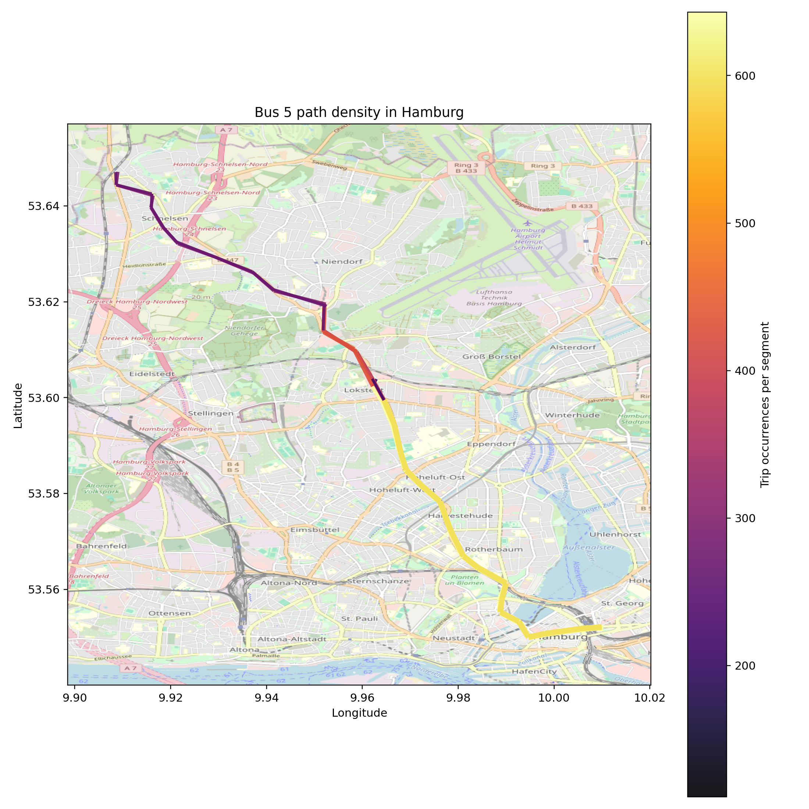
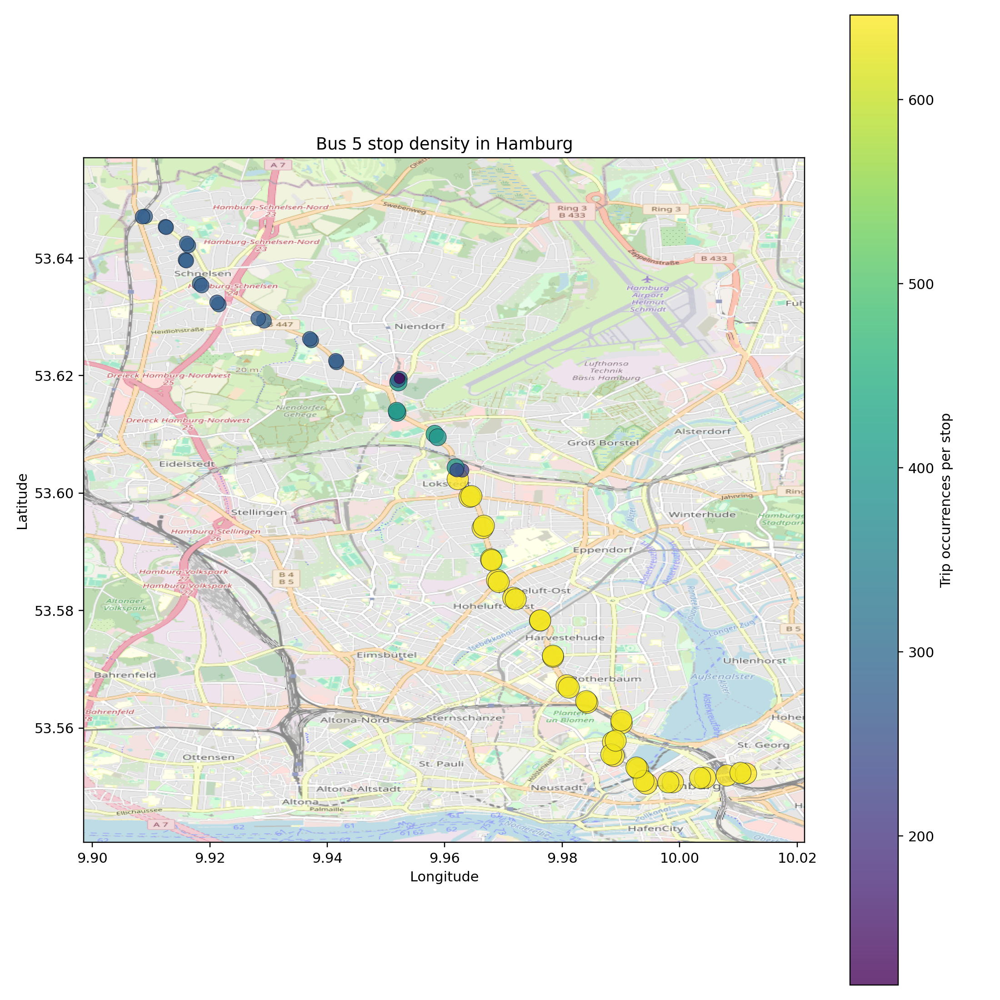
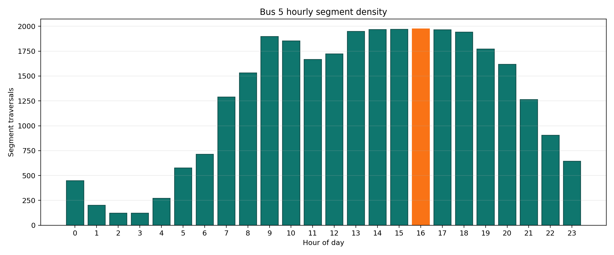
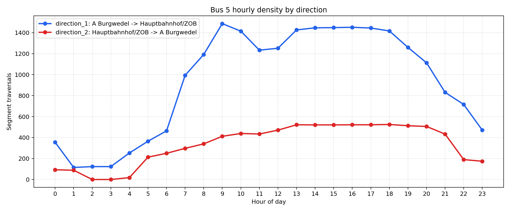
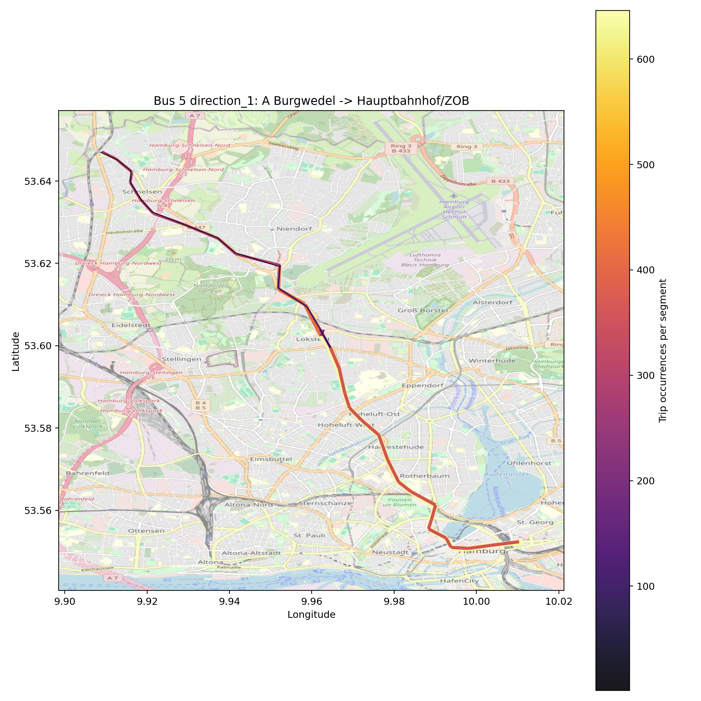
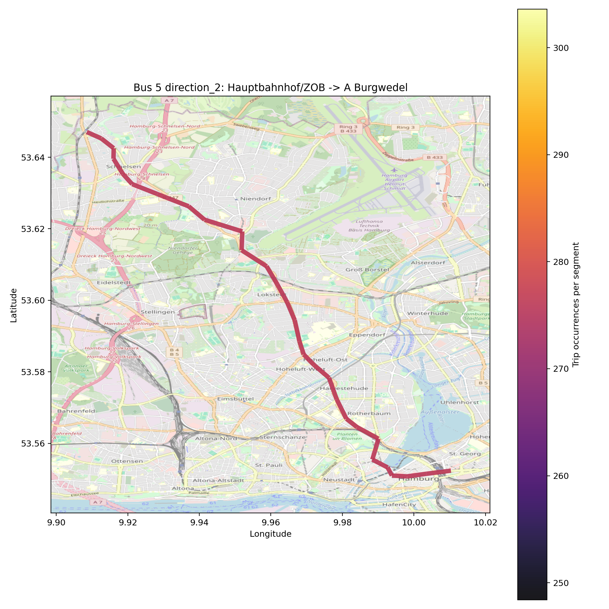
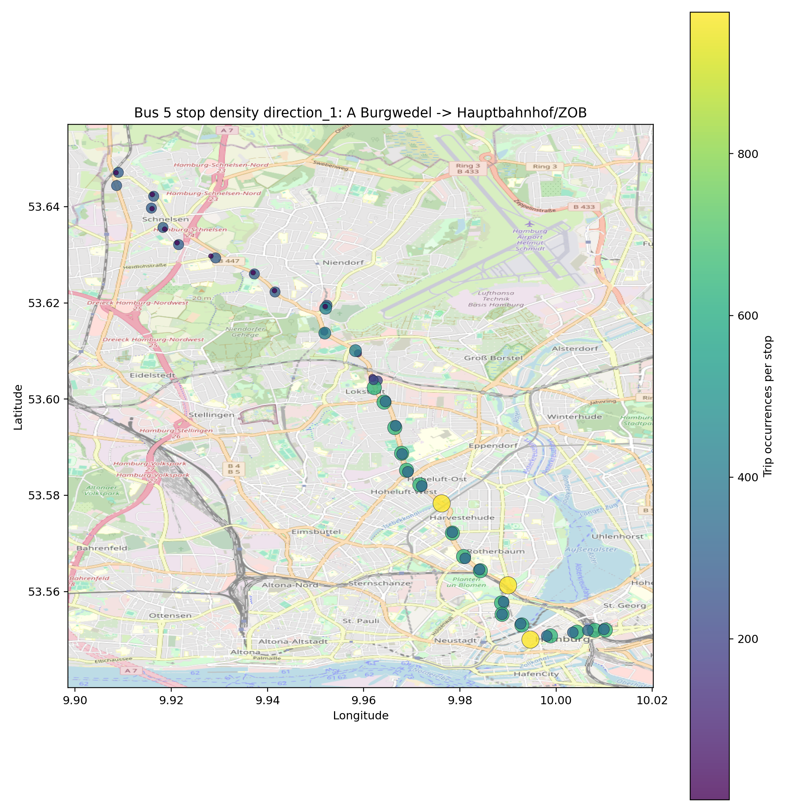
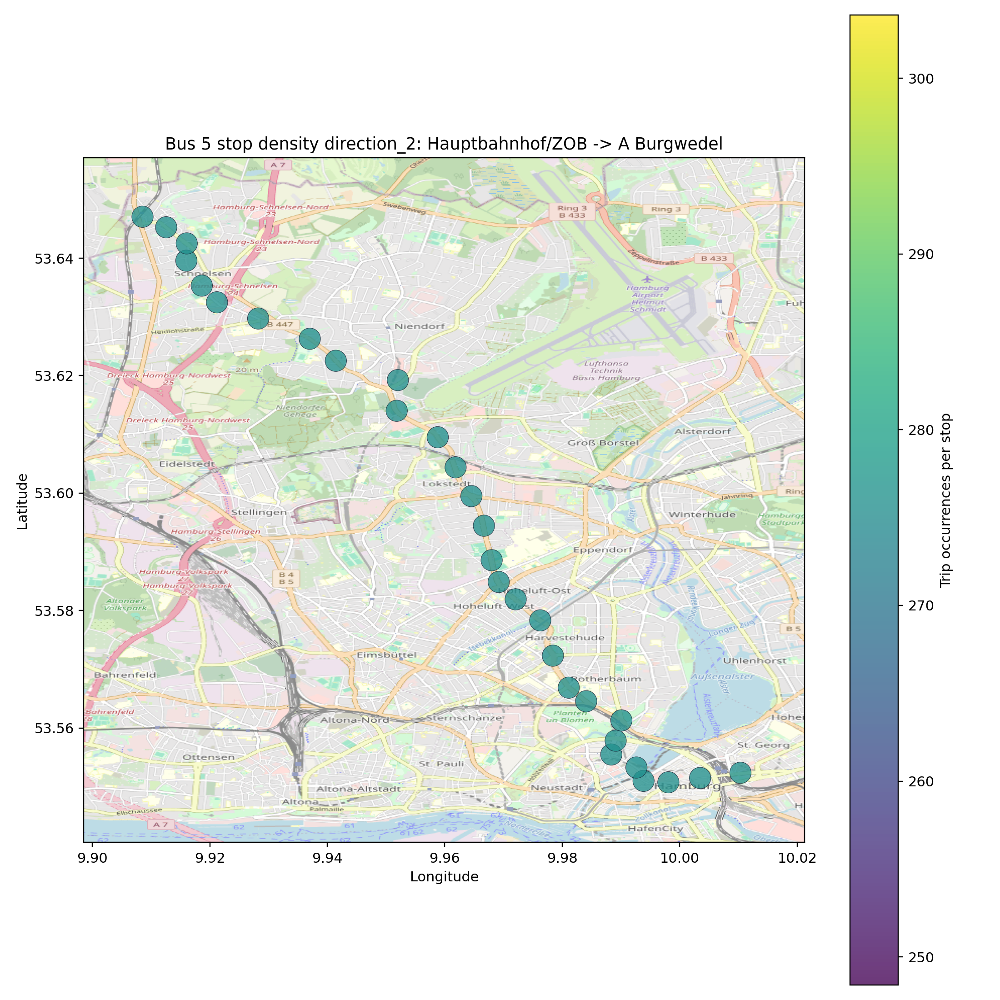
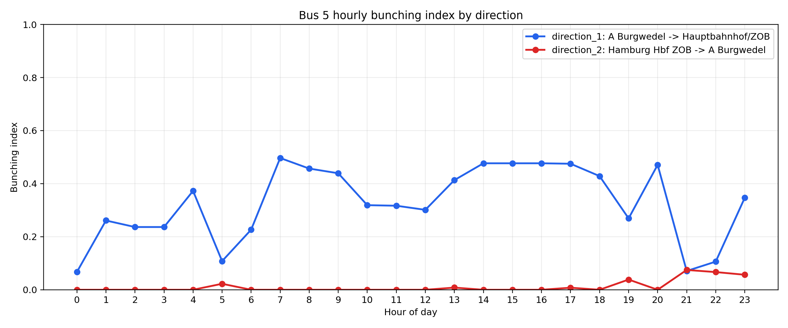
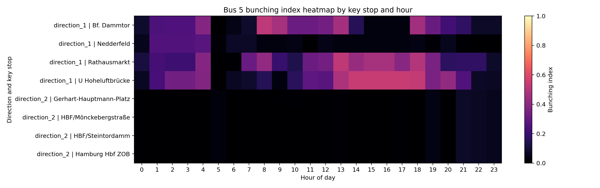

# GTFS Bus 5 Workflow (Hamburg)

This workspace is dedicated to one topic only: extracting and analyzing bus line 5 from a GTFS feed, focused on Hamburg.

The workflow has four stages:

1. Validate or filter source GTFS to Hamburg.
2. Filter Hamburg GTFS to line 5 (bus).
3. Build path and stop density analytics with maps and hourly charts.
4. Quantify schedule-based bunching risk by direction and key stop.

## Project Goal

The goal is to produce a clean, reproducible pipeline that answers:

- Where bus 5 runs most frequently in Hamburg.
- How service intensity changes by hour.
- Whether schedule spacing shows bunching-like patterns.

## Summary 

The pipeline ran from input folder and then output throguuh output folder for ease pipeline look.
And This version : input folder runs on filtered only by Bus 5 (HH) only. 

### Bus 5 service is directional:
- Direction 1 Burgwedel -> Hauptbahnhof/ZOB  
- Direction 2 Hauptbahnhof/ZO  -> Burgwedel 
### Pattern
- Direction 1 has heavier and more compressed service patterns than Direction 2
- Peak network activity is in the late afternoon (around 16:00), showing highest segment movement then.
- Bunching risk is mostly moderate in Direction 1 during busy periods, while Direction 2 is generally low-risk except some late-evening spikes.
- Key-stop heatmap shows most values are low overall, meaning widespread severe bunching is not dominant in this schedule, but there are specific hour-direction hotspots worth monitoring.

## Scripts and Responsibilities

- filter_hamburg_gtfs.py
	- Input: source GTFS folder.
	- Output: Hamburg-only GTFS subset.
	- Modes:
		- strict: keep only stop_times rows at Hamburg stops.
		- connected: keep full trips that touch Hamburg.

- filter_bus5_gtfs.py
	- Input: Hamburg GTFS subset.
	- Output: line-specific GTFS subset (default line 5, route_type 3).
	- Keeps GTFS integrity across routes, trips, stop_times, stops, agency, calendar, and calendar_dates.

- analyze_bus5_density.py
	- Input: bus 5 GTFS subset.
	- Output: map and chart artifacts for density analysis.
	- Includes:
		- OSM basemap overlays.
		- Direction split maps.
		- Hourly density charts.

- bus5bunching.py
	- Input: bus 5 GTFS subset.
	- Output: bunching report CSVs and charts.
	- Includes:
		- Hourly bunching index by direction.
		- Hourly bunching index by key stops.

- run_bus5_pipeline.py
	- Orchestrates end-to-end run for stages 1 to 3.
	- Bunching can be run as an additional command after pipeline completion.

## Data Flow

1. Source GTFS
	 - input/

2. Hamburg subset
	 - output/gtfs_hamburg

3. Bus 5 subset
	 - output/gtfs_5bus

4. Analytics outputs
	 - output/bus5_density

This layered design is intentional:

- Each stage can be validated independently.
- Re-running downstream stages does not require repeating expensive upstream work.
- Intermediate outputs are auditable and reusable.

## Methodology (Detailed)

### A) Hamburg filtering approach

The Hamburg filter identifies stops within a configured geographic bounding box and keeps related records according to selected mode.

- strict mode:
	- Keeps only stop_times rows whose stop_id is in Hamburg.
	- Produces a geographically strict subset.

- connected mode:
	- Selects trips that visit at least one Hamburg stop.
	- Keeps all stop_times for those trips, including out-of-bounds sections.
	- Produces an operationally connected subset.

### B) Bus 5 filtering approach

The line filter starts from routes where:

- route_short_name equals target line (default 5), and
- route_type equals 3 (bus) unless route_type is set to all.

Then it cascades through dependent GTFS tables:

1. trips linked to selected routes.
2. stop_times linked to selected trips.
3. stops referenced by selected stop_times.
4. agency rows referenced by selected routes.
5. calendar and calendar_dates rows referenced by selected trips.

This preserves a valid GTFS subset for line-specific analysis.

### C) Density analysis approach

For every selected trip:

1. Stop_times are ordered by stop_sequence.
2. Consecutive stop pairs define directed segments.
3. Segment frequency counts how often each edge is traversed.
4. Stop frequency counts how often each stop is visited.

Direction split is inferred from first-stop to last-stop pairs:

- The two most common origin-destination patterns are treated as opposite directions.

Hourly analysis:

- Segment traversals are bucketed by hour of departure time.
- Aggregated for all trips and by inferred direction.

Map rendering:

- OSM raster tiles are fetched at runtime.
- Line and stop densities are drawn over tile basemap.
- Color and line thickness encode intensity.

### D) Bunching analysis approach

Important: this is schedule-based bunching risk, not realtime observed bunching.

Peak date selection:

- The script computes scheduled trips per service day from calendar plus calendar_dates.
- It chooses the day with highest scheduled trip volume.

Headway construction:

- Direction-level metrics use trip-start departure times.
- Key-stop metrics use departure times at that stop.
- Hourly headways are consecutive gaps within each hour.

Metrics per hour:

- departures
- headways_n
- mean_headway_min
- median_headway_min
- cv_headway (coefficient of variation)
- short_ratio (fraction of headways below threshold, default 3 minutes)

Bunching index:

- Combines short headway ratio and headway variability.
- Formula:
	- cv_component = min(cv_headway, 2.0) / 2.0
	- bunching_index = 0.6 * short_ratio + 0.4 * cv_component
- Index range is 0 to 1.

Interpretation guide:

- 0.00 to 0.20: low bunching risk.
- 0.20 to 0.50: moderate bunching risk.
- 0.50 to 1.00: elevated bunching risk.

## Analysis Results (output/bus5_density)

All findings below are derived from the hvv snapshot `2025-1-8T8:30:28`, with scheduled service dates spanning 2025-01-08 to 2025-12-13. Results reflect scheduled service, not realtime observations.

### Route Overview

- Operator: Hamburger Verkehrsverbund (hvv)
- Route id: 1369_3 (route_short_name 5, bus)
- Total scheduled trips in dataset: 1,281
- Unique stops served: 65
- Unique path segments: 63
- Detected directions: 2 (A Burgwedel → Hauptbahnhof/ZOB and Hauptbahnhof/ZOB → A Burgwedel)

### Direction Asymmetry

The two directions differ significantly in both coverage and volume:

| Direction | Segment traversals | Unique segments |
|---|---|---|
| Direction 1 — A Burgwedel → Hauptbahnhof/ZOB | 22,400 | 62 |
| Direction 2 — Hauptbahnhof/ZOB → A Burgwedel | 8,004 | 29 |

Direction 1 still dominates the route. It covers more than twice as many unique segments and generates nearly three times the traversal volume, which indicates the longer branch pattern remains concentrated on the Nedderfeld corridor.

### Stop and Segment Density

The highest-volume stop and segment counts are concentrated on the inbound branch:

- Nedderfeld — 646 trip occurrences (rank 1)
- Siemersplatz — 646 trip occurrences (rank 2)
- Brunsberg — 646 trip occurrences (rank 3)

The top segment remains Nedderfeld → Siemersplatz with 646 traversals, followed by a continuous chain of equally busy inbound segments toward the city centre.

This pattern means the directional imbalance is strong enough that branch-specific stops outrank the common trunk when stop IDs are counted separately by platform and direction.

### Hourly Service Intensity

Peak hour for segment activity: 16:00 with 1,974 traversals across all directions.

Service profile by time window:

- Night (00:00-04:00): Low activity. Direction 1 keeps limited service, while direction 2 disappears from 01:00 to 03:00 and has only a single departure around 04:00.
- Early morning (05:00-06:00): Both directions resume building toward the peak.
- Morning peak (07:00-09:00): Segment activity rises quickly from 1,291 at 07:00 to 1,899 at 09:00.
- Afternoon plateau (13:00-18:00): The strongest sustained demand window, with every hour between 1,942 and 1,974 traversals.
- Evening taper (19:00-23:00): Activity falls from 1,773 to 645 traversals per hour.

The asymmetry in daytime frequency is still notable. Direction 1 reaches 29 to 30 departures per hour in the busiest windows, while direction 2 stays close to a six-buses-per-hour clock-face pattern for most of the day.

### Bunching Risk (peak date 2025-04-17, 537 scheduled trips)

#### Direction 1 — A Burgwedel → Hauptbahnhof/ZOB

Direction 1 shows clear bunching pressure in the busiest daytime windows:

- 07:00 to 09:00: Bunching index rises from 0.4977 to 0.5402. Mean headway is about 2 minutes, and the short-headway ratio reaches 79.3% at 09:00.
- 13:00 and 18:00 to 20:00: Risk returns after midday, with moderate-to-high values between 0.4710 and 0.4943 as short gaps remain common.
- Off-peak hours: Risk drops sharply once the timetable opens back up, especially after 21:00.

Hour 09 is the single worst direction-level hour (index 0.5402), which pushes this snapshot into the elevated-risk band.

At the selected key-stop level, maxima remain low in this snapshot:

| Stop | Peak hour | Bunching index | Short ratio |
|---|---|---|---|
| Brunsberg | 06:00 | 0.069 | 0.000 |
| Nedderfeld | 06:00 | 0.075 | 0.000 |
| Siemersplatz | 06:00 | 0.069 | 0.000 |
| Veilchenweg (Ost) | 06:00 | 0.069 | 0.000 |

That gap between route-level and key-stop results suggests the strongest schedule compression is visible at trip origins and branch departure sequencing, not as a broad all-stop problem at the selected stop slices.

#### Direction 2 — Hauptbahnhof/ZOB → A Burgwedel

Direction 2 shows no meaningful bunching risk at any hour:

- Daytime (05:00-20:00): Headways are uniformly 10 minutes (CV near 0.00, bunching index 0.00-0.04).
- Maximum index across all 24 hours: 0.0963 at 00:00, with the rest of the day remaining well inside the low-risk range.

This direction operates as a fixed-interval, clock-face service with predictable, evenly spaced departures.

#### Summary

| Metric | Direction 1 | Direction 2 |
|---|---|---|
| Peak bunching index | 0.540 (09:00) | 0.096 (00:00) |
| Risk classification | Elevated at peak, otherwise moderate | Low |
| Mean peak headway | 2.0 min | 13.5 min |
| Hours with index > 0.40 | 6 of 24 | 0 of 24 |
| Service gap (no trips) | None | 01:00-03:00 |

The core finding remains the same in the 2025 snapshot: the high-frequency inbound pattern toward Hauptbahnhof/ZOB creates structurally compressed headways, while the opposite direction stays close to a regular 10-minute timetable and avoids bunching risk.

## Install

```bash
pip install -r requirements.txt
```

## Run Commands

### Full core pipeline (stages 1 to 3)

```bash
python run_bus5_pipeline.py
```

### Full core pipeline with explicit options

```bash
python run_bus5_pipeline.py --hamburg-mode strict --line 5 --route-type 3 --zoom 13
```

### Run bunching analysis (stage 4)

```bash
python bus5bunching.py --gtfs-dir output/gtfs_5bus --output-dir output/bus5_density --line 5 --route-type 3 --short-headway-min 3 --key-stops-per-direction 4
```

## Output Artifacts

### Density outputs

- bus5_path_density.png: route-wide segment intensity map showing where bus 5 travels most often.
- bus5_stop_density.png: route-wide stop activity map showing which stops receive the most scheduled visits.
- bus5_path_density_direction_1.png: direction 1 segment map highlighting the heavier inbound branch toward Hauptbahnhof/ZOB.
- bus5_path_density_direction_2.png: direction 2 segment map showing the shorter outbound pattern back toward A Burgwedel.
- bus5_stop_density_direction_1.png: direction 1 stop map showing which inbound stops concentrate the most service.
- bus5_stop_density_direction_2.png: direction 2 stop map showing stop activity on the outbound return pattern.
- bus5_hourly_activity.png: all-direction hourly segment volume chart showing when scheduled movement is highest.
- bus5_hourly_by_direction.png: hourly comparison chart showing how strongly the two directions differ by time of day.
- bus5_top_stops.csv: ranked table of the busiest stops by scheduled trip occurrences.
- bus5_top_segments.csv: ranked table of the busiest stop-to-stop segments by scheduled traversals.
- bus5_hourly_activity.csv: numeric hourly totals behind the activity charts for reuse in other analysis.
- bus5_density_summary.txt: compact text summary of the main density findings and detected route structure.

### Bunching outputs

- bus5_bunching_hourly_direction.csv: hourly route-direction bunching metrics built from trip-start headways.
- bus5_bunching_hourly_keystops.csv: hourly key-stop bunching metrics showing where stop-level schedule compression is strongest.
- bus5_bunching_hourly_direction.png: direction-level bunching chart showing when each direction is most at risk.
- bus5_bunching_keystops_heatmap.png: heatmap of key-stop bunching intensity by hour for quick hotspot scanning.
- bus5_bunching_summary.txt: short text briefing with the peak scheduled day and worst direction/key-stop bunching results.

## Figures Included In Repository

Generated output files are written to `output/bus5_density` and embedded below.

### Density maps and charts






### Direction-specific maps






### Bunching visuals




## Practical Notes

- GTFS times may exceed 24:00:00 for post-midnight service on same service day.
- Basemap tiles are fetched from OpenStreetMap at runtime and require network access.
- For observed bunching validation, add realtime AVL data and compare scheduled vs actual headways.

## GitHub Publishing Setup

This repository is configured to publish code plus selected generated figures.

- Large local data folders are ignored by git:
	- input
	- output
- Python environment and cache folders are ignored:
	- .venv
	- __pycache__

If you want to share sample data, add a small anonymized sample folder and update commands to point to that sample path.

### Suggested First Push

Run these commands in this folder:

```bash
git init
git add .
git commit -m "Initial commit: GTFS bus 5 Hamburg workflow"
git branch -M main
git remote add origin <your-github-repo-url>
git push -u origin main
```


